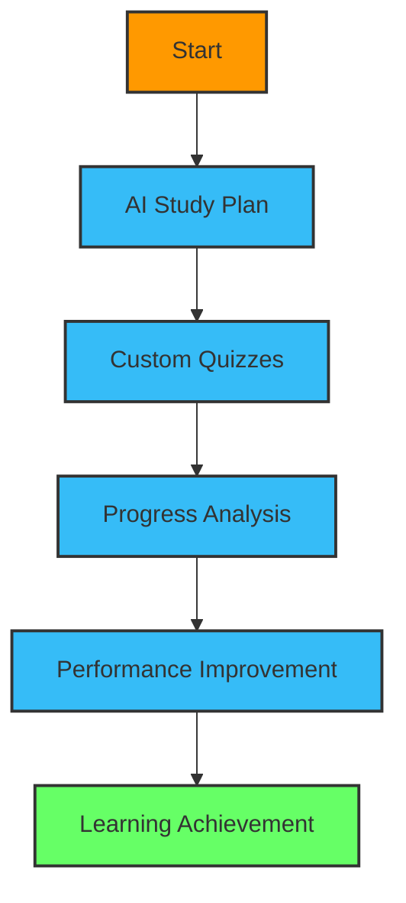

# <div align="center">👋 Hello, I'm Maria Habib</div>

<div align="center">
  
[](https://git.io/typing-svg)

</div>

<div align="center">
  
  
  
</div>

## 🎓 About Me

<table>
  <tr>
    <td>
      I'm a 6th semester BSIT student at Punjab University College of Information Technology (PUCIT), passionate about web development and artificial intelligence.
      <br><br>
     
     

```javascript


```
   
    
  </tr>
</table>

## 🛠️ Skills

<div align="center">
  
### Programming Languages & Tools
  
</div>

<table align="center">
  <tr>
    <td align="center" width="96">
      
      <br>Ruby
    </td>
    <td align="center" width="96">
      
      <br>JavaScript
    </td>
    <td align="center" width="96">
      
      <br>Python
    </td>
    <td align="center" width="96">
      
      <br>React
    </td>
    <td align="center" width="96">
      
      <br>GitHub
    </td>
  </tr>
  <tr>
    <td align="center" width="96">
      
      <br>Rails
    </td>
    <td align="center" width="96">
      
      <br>MySQL
    </td>
    <td align="center" width="96">
      
      <br>C++
    </td>
    <td align="center" width="96">
      
      <br>HTML
    </td>
    <td align="center" width="96">
      
      <br>CSS
    </td>
  </tr>
</table>


## 🚀 Featured Project: LearnCraft AI

<details open>
<summary><b>🎓 LearnCraft AI - Personalized Learning Portal</b></summary>
<br>

<div align="center">
  
</div>

<div align="center">
  
  
  
</div>

### About LearnCraft AI
LearnCraft AI is a personalized learning portal designed to enhance the study experience by leveraging artificial intelligence. It generates custom study plans, quizzes, and summaries based on the user's input, helping students improve their learning efficiency.

<table>
  <tr>
    <td>
      <h4>Key Features:</h4>
      <ul>
        <li>🔹 Personalized learning experience tailored to individual needs</li>
        <li>🔹 AI-driven content generation for study materials</li>
        <li>🔹 Comprehensive progress tracking system</li>
        <li>🔹 Adaptive learning pathways based on performance</li>
        <li>🔹 Interactive dashboard with performance insights</li>
      </ul>
    </td>
    <td>
      <h4>Project Highlights:</h4>
      <div>
        
        
        
      </div>
    </td>
  </tr>
</table>

<div align="center">
  <h3>User Learning Journey</h3>
  


</div>

<div align="center">
  <a href="https://github.com/mariahabib/learncraft-ai">
    
  </a>
</div>

</details>

## 📚 Educational Journey

<div align="center">
  
### BSIT Progress
  


```
┌──────────────────────────────────────────────────────┐
│  🎯 Current Focus: Web Applications & AI Integration │
│  🌱 Next Goal: Advanced Machine Learning             │
└──────────────────────────────────────────────────────┘
```
</div>

## 📫 Connect With Me

<div align="center">
  <a href="mailto:mariahabibit@gmail.com">
    
  </a>
  <a href="https://www.linkedin.com/in/MariaHabib">
    
  </a>
  <a href="https://github.com/mariahabib">
    
  </a>
</div>

## 🖥️ Ruby on Rails & AI Development

<details>
<summary><b>My Development Philosophy</b></summary>
<br>

<div align="center">
  
</div>

<h4 align="center">Core Development Principles:</h4>

<table align="center">
  <tr>
    <td align="center">
      
      <p>Writing maintainable, readable code</p>
    </td>
    <td align="center">
      
      <p>Designing with users in mind</p>
    </td>
    <td align="center">
      
      <p>Intelligent data utilization</p>
    </td>
  </tr>
  <tr>
    <td align="center">
      
      <p>Always improving skills</p>
    </td>
    <td align="center">
      
      <p>Responsible AI implementation</p>
    </td>
    <td align="center">
      
      <p>Finding creative solutions</p>
    </td>
  </tr>
</table>

</details>

<div align="center">
  
  
</div>

<div align="center">
💻 Building the future of education, one line of code at a time 💻
</div>
